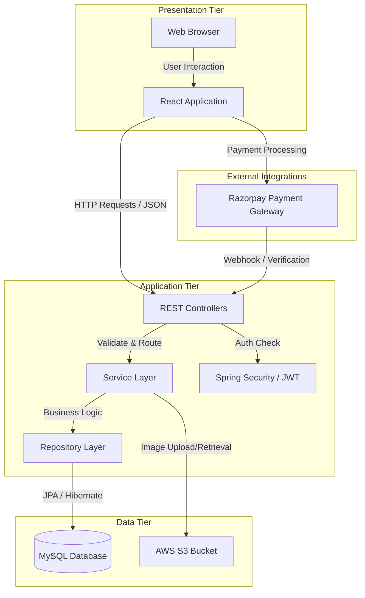
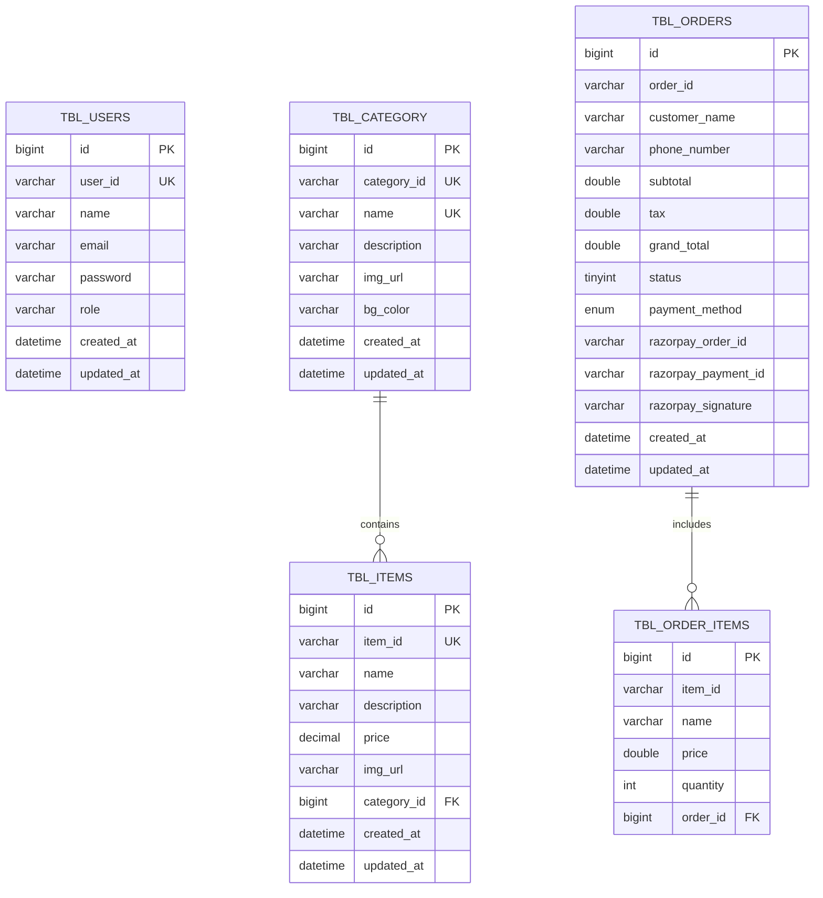

# Project Report: Billing Software

## Abstract
The **Billing Software** is a comprehensive full-stack web application designed to streamline the billing and inventory management process for small to medium-sized businesses. Built using a robust technology stack comprising **Spring Boot** for the backend and **React** for the frontend, the system offers a secure, efficient, and user-friendly interface. Key features include role-based user authentication (Admin and User), dynamic category and item management, real-time order processing with tax calculation, and integrated payment gateway support via **Razorpay**. The application leverages **MySQL** for reliable data persistence and **AWS S3** for scalable image storage, ensuring a modern and scalable solution for retail operations.

## Project Overview
In the modern retail environment, efficient management of inventory and billing is crucial for operational success. This project aims to digitize these manual processes, reducing errors and saving time.

The application is structured as a decoupled architecture:
*   **Frontend**: A responsive Single Page Application (SPA) built with **React**, **Vite**, and **Bootstrap**. It provides an intuitive dashboard for admins to manage products and for staff to generate bills.
*   **Backend**: A RESTful API developed with **Spring Boot (Java 21)**. It handles business logic, data validation, and security using **Spring Security** and **JWT** (JSON Web Tokens).
*   **Database**: **MySQL** is used as the relational database management system to store user data, product catalogs, and transaction history.
*   **External Integrations**: The system integrates **Razorpay** for handling digital payments and **AWS S3** for cloud-based storage of product images.

## Objectives of the Project
The primary objectives of the Billing Software project are as follows:

1.  **Digitize Billing Operations**: To replace manual paper-based billing with an automated digital system, ensuring accuracy in calculations (subtotal, tax, grand total).
2.  **Efficient Inventory Management**: To provide a centralized platform for adding, updating, and categorizing products, making stock management effortless.
3.  **Secure Access Control**: To implement a secure authentication system with role-based access control (RBAC), distinguishing between Administrators (who manage inventory) and Users (who handle billing).
4.  **Seamless Payment Processing**: To offer multiple payment modes, including Cash and UPI, integrated directly into the billing workflow for faster checkout.
5.  **Scalable Architecture**: To design a modular and scalable application using industry-standard technologies (Spring Boot, React) that can grow with the business needs.
6.  **User-Friendly Interface**: To deliver a clean, responsive, and easy-to-navigate user interface that requires minimal training for end-users.

## Scope of the Project
The scope of the Billing Software defines the boundaries of the system, outlining what features and functionalities are included in the current release.

### In-Scope Features
1.  **User Management & Authentication**:
    *   Secure Registration and Login functionality.
    *   Role-Based Access Control (RBAC) for `ADMIN` and `USER` roles.
    *   JWT-based session management for secure API communication.

2.  **Inventory Management (Admin Only)**:
    *   **Category Management**: Create, update, and delete product categories with images.
    *   **Item Management**: Add new items, update prices/details, and map them to categories.
    *   Image upload capability using AWS S3 integration.

3.  **Billing & Order Processing**:
    *   **Point of Sale (POS) Interface**: User-friendly interface for selecting items and creating orders.
    *   **Cart Management**: Add/remove items, adjust quantities, and view real-time totals.
    *   **Tax Calculation**: Automated calculation of taxes (e.g., GST) on the subtotal.
    *   **Invoice Generation**: Creation of digital order records with unique Order IDs.

4.  **Payment Integration**:
    *   Support for **Cash** payments.
    *   Integration with **Razorpay** for online payments (UPI, Cards, Netbanking).

5.  **Dashboard & Reporting**:
    *   Visual dashboard for Admins to view total categories and items.
    *   Order history view for tracking past transactions.

### Out-of-Scope (Future Enhancements)
*   Multi-branch/Multi-store support.
*   Advanced analytics and sales forecasting.
*   Customer loyalty programs and discounts.
*   Offline mode functionality.

## System Requirements
To ensure optimal performance and stability of the Billing Software, the following hardware and software configurations are recommended.

### Hardware Requirements
| Component | Minimum Requirement | Recommended Requirement |
| :--- | :--- | :--- |
| **Processor** | Intel Core i3 / AMD Ryzen 3 | Intel Core i5 / AMD Ryzen 5 or higher |
| **RAM** | 4 GB | 8 GB or higher |
| **Storage** | 256 GB SSD | 512 GB SSD or higher |
| **Display** | 1366 x 768 resolution | 1920 x 1080 (Full HD) resolution |
| **Internet** | Stable Broadband (2 Mbps) | High-speed Fiber (10 Mbps+) for payments |

### Software Requirements
| Component | Specification |
| :--- | :--- |
| **Operating System** | Windows 10/11, macOS, or Linux (Ubuntu 20.04+) |
| **Web Browser** | Google Chrome (latest), Mozilla Firefox, Microsoft Edge |
| **Backend Runtime** | Java Development Kit (JDK) 21 |
| **Frontend Runtime** | Node.js v18.0.0 or higher |
| **Database** | MySQL Server 8.0 |
| **Build Tools** | Maven (Backend), Vite (Frontend) |

## Technologies Used
The Billing Software is built upon a modern, scalable, and secure technology stack. Each component has been carefully selected to ensure high performance, maintainability, and a superior user experience.

### 1. Frontend Technologies
The client-side application is a Single Page Application (SPA) designed for responsiveness and interactivity.

*   **React.js (v19)**: A powerful JavaScript library for building user interfaces. It allows for the creation of reusable UI components, ensuring a consistent look and feel across the application.
*   **Vite**: A next-generation frontend build tool that provides a lightning-fast development server and optimized production builds.
*   **Bootstrap 5**: A popular CSS framework used for responsive grid layouts and pre-styled components (buttons, forms, modals), ensuring the application looks good on all device sizes.
*   **React Router DOM**: Handles client-side routing, enabling seamless navigation between different views (e.g., Dashboard, Billing, Login) without reloading the page.
*   **Axios**: A promise-based HTTP client used to communicate with the backend REST APIs securely.
*   **React Hot Toast**: A lightweight library for displaying beautiful, non-intrusive notifications (toasts) for user feedback (e.g., "Login Successful", "Item Added").

### 2. Backend Technologies
The server-side application is robust, secure, and designed to handle complex business logic.

*   **Java 21**: The latest Long-Term Support (LTS) version of Java, providing enhanced performance and modern language features.
*   **Spring Boot (v3.4.4)**: A framework that simplifies the development of production-ready Spring applications. It provides embedded server support (Tomcat) and auto-configuration.
*   **Spring Security**: A powerful and highly customizable authentication and access-control framework. It secures the application using standard protocols.
*   **Spring Data JPA**: Abstraction over JPA (Java Persistence API) that significantly reduces the amount of boilerplate code required to implement data access layers.
*   **JSON Web Tokens (JWT)**: Used for stateless authentication. Upon login, the server issues a token which the client sends with subsequent requests to verify identity.
*   **Lombok**: A Java library that automatically plugs into the editor and build tools, spicing up Java. It generates getters, setters, constructors, and logging code to reduce verbosity.

### 3. Database
*   **MySQL**: An open-source relational database management system (RDBMS). It is used to store structured data including user profiles, product details, categories, and order records. It ensures data integrity and supports complex queries.

### 4. External Integrations & Tools
*   **Razorpay**: A payment gateway integration that allows the application to accept online payments via UPI, Credit/Debit Cards, and Netbanking securely.
*   **AWS S3 (Simple Storage Service)**: A cloud object storage service used to store and retrieve product images. This offloads storage from the application server and ensures high availability of media assets.
*   **Maven**: A build automation tool used for managing backend dependencies and building the Java project.
*   **Git**: Version control system used for tracking changes in the source code during development.

## Modules
The Billing Software is divided into distinct modules, each responsible for specific functionalities. This modular approach ensures code maintainability and separation of concerns.

### 1. User Authentication Module
This module handles the security and access control of the application.
*   **Registration**: Allows new users to sign up by providing necessary details. Passwords are encrypted before storage.
*   **Login**: Authenticates users using email and password. Upon success, a JWT token is generated.
*   **Role Management**: Assigns roles (`ADMIN` or `USER`) to users, restricting access to specific parts of the application (e.g., only Admins can access Inventory).
*   **Session Handling**: Manages user sessions securely using stateless JWT tokens.

### 2. Inventory Management Module
This module is the core for managing the product catalog and is accessible primarily to Administrators.
*   **Category Management**:
    *   Add new product categories (e.g., Electronics, Groceries) with descriptions and cover images.
    *   Edit or delete existing categories.
*   **Item Management**:
    *   Add new items under specific categories.
    *   Upload item images to AWS S3.
    *   Update item details such as price, name, and description.
    *   Delete obsolete items from the inventory.

### 3. Billing & POS Module
This module is the front-facing interface for processing sales transactions.
*   **Product Selection**: Allows users to browse categories and select items to add to the bill.
*   **Cart Functionality**:
    *   Real-time addition and removal of items.
    *   Quantity adjustment for each item.
    *   Automatic calculation of line-item totals.
*   **Order Summary**: Displays the subtotal, calculated tax (e.g., 1% tax), and the final grand total before checkout.

### 4. Payment Module
This module handles the financial transaction aspect of the order.
*   **Payment Mode Selection**: Users can choose between "Cash" and "Online Payment".
*   **Razorpay Integration**: For online payments, the system initiates a secure transaction via Razorpay, supporting UPI, Cards, and Netbanking.
*   **Payment Verification**: Verifies the payment status (Success/Failure) before confirming the order.

### 5. Reporting & Dashboard Module
This module provides insights and historical data.
*   **Admin Dashboard**: Displays key metrics such as the total number of categories and items in the system.
*   **Order History**: A comprehensive list of all past orders, showing details like Order ID, Customer Name, Date, Payment Method, and Total Amount.

## Architectural Design
The Billing Software follows a classic **Three-Tier Architecture**, which separates the application into three logical and physical computing tiers: the Presentation Tier, the Application Tier, and the Data Tier. This separation ensures modularity, scalability, and ease of maintenance.

### 1. Presentation Tier (Frontend)
*   **Role**: This is the top-most level of the application, responsible for the user interface and user interaction.
*   **Technology**: Built using **React.js**.
*   **Functionality**: It presents data to the user and collects user inputs. It communicates with the backend via RESTful APIs using Axios. It handles client-side routing and state management.

### 2. Application Tier (Backend)
*   **Role**: This tier contains the business logic, processes commands, makes logical decisions, and performs calculations. It acts as a bridge between the frontend and the database.
*   **Technology**: Built using **Spring Boot (Java)**.
*   **Structure**:
    *   **Controller Layer**: Handles incoming HTTP requests and sends responses.
    *   **Service Layer**: Contains the core business logic (e.g., calculating totals, processing payments).
    *   **Repository Layer (DAO)**: Interacts directly with the database using JPA.
    *   **Security Layer**: Manages authentication and authorization using Spring Security and JWT.

### 3. Data Tier (Database)
*   **Role**: This tier is responsible for storing and retrieving information.
*   **Technology**: **MySQL Database**.
*   **Functionality**: It preserves data consistency and integrity. It stores user credentials, product details, and order records.

### Architecture Diagram
The following diagram illustrates the high-level architecture and data flow of the system:

### Data Flow
1.  **User Action**: The user interacts with the React frontend (e.g., clicks "Checkout").
2.  **API Request**: The frontend sends an HTTP request (e.g., `POST /api/orders`) to the Spring Boot backend.
3.  **Security Check**: The request is intercepted by the Security Filter Chain to validate the JWT token.
4.  **Processing**: The Controller receives the request and passes it to the Service layer.
5.  **Data Access**: The Service layer performs necessary calculations and calls the Repository to save the order in the MySQL database.
6.  **Response**: The backend sends a JSON response back to the frontend (e.g., Order Created Successfully).
7.  **UI Update**: The React frontend updates the UI to show the order confirmation.

## Database Design
The database is designed using a relational model to ensure data integrity and minimize redundancy. The system uses **MySQL** as the primary database.

### Entity-Relationship (ER) Diagram
The following diagram represents the entities and their relationships within the database:

### Table Descriptions

#### 1. `tbl_users`
Stores information about the system users (Admins and Staff).
*   **id**: Primary Key, Auto Increment.
*   **user_id**: Unique public identifier for the user.
*   **name**: Full name of the user.
*   **email**: User's email address (used for login).
*   **password**: Encrypted password.
*   **role**: Role of the user (`ADMIN` or `USER`).

#### 2. `tbl_category`
Stores product categories.
*   **id**: Primary Key, Auto Increment.
*   **category_id**: Unique public identifier.
*   **name**: Name of the category (e.g., "Beverages").
*   **description**: Brief description of the category.
*   **img_url**: URL of the category image stored in S3.
*   **bg_color**: Background color code for UI display.

#### 3. `tbl_items`
Stores individual product items linked to a category.
*   **id**: Primary Key, Auto Increment.
*   **item_id**: Unique public identifier.
*   **name**: Name of the item (e.g., "Cappuccino").
*   **price**: Unit price of the item.
*   **category_id**: Foreign Key referencing `tbl_category`.

#### 4. `tbl_orders`
Stores summary details of every customer order.
*   **id**: Primary Key, Auto Increment.
*   **order_id**: Unique identifier for the order.
*   **customer_name**: Name of the customer.
*   **grand_total**: Final amount paid.
*   **payment_method**: Mode of payment (`CASH` or `UPI`).
*   **status**: Order status (e.g., Pending, Completed).

#### 5. `tbl_order_items`
Stores the individual items belonging to a specific order.
*   **id**: Primary Key, Auto Increment.
*   **order_id**: Foreign Key referencing `tbl_orders`.
*   **item_id**: ID of the item purchased.
*   **quantity**: Number of units purchased.
*   **price**: Price per unit at the time of purchase.

## API Documentation
The backend exposes a set of RESTful APIs for the frontend to consume. All APIs (except Login/Register) are secured using JWT Authentication.

### 1. Authentication APIs
| Method | Endpoint | Description | Access |
| :--- | :--- | :--- | :--- |
| `POST` | `/login` | Authenticates a user and returns a JWT token. | Public |
| `POST` | `/register` | Registers a new user. | Public |

### 2. Category APIs
| Method | Endpoint | Description | Access |
| :--- | :--- | :--- | :--- |
| `GET` | `/categories` | Fetches all product categories. | Authenticated |
| `POST` | `/admin/categories` | Adds a new category (requires image file). | Admin |
| `DELETE` | `/admin/categories/{categoryId}` | Deletes a category by ID. | Admin |

### 3. Item APIs
| Method | Endpoint | Description | Access |
| :--- | :--- | :--- | :--- |
| `GET` | `/items` | Fetches all items. | Authenticated |
| `POST` | `/admin/items` | Adds a new item (requires image file). | Admin |
| `DELETE` | `/admin/items/{itemId}` | Deletes an item by ID. | Admin |

### 4. Order APIs
| Method | Endpoint | Description | Access |
| :--- | :--- | :--- | :--- |
| `POST` | `/orders` | Creates a new order. | Authenticated |
| `GET` | `/orders/latest` | Fetches the most recent orders. | Authenticated |
| `DELETE` | `/orders/{orderId}` | Deletes an order by ID. | Authenticated |

### 5. Payment APIs
| Method | Endpoint | Description | Access |
| :--- | :--- | :--- | :--- |
| `POST` | `/payments/create-order` | Creates a Razorpay order for online payment. | Authenticated |
| `POST` | `/payments/verify` | Verifies the payment signature after transaction. | Authenticated |

### 6. User & Profile APIs
| Method | Endpoint | Description | Access |
| :--- | :--- | :--- | :--- |
| `GET` | `/profile` | Fetches the logged-in user's profile. | Authenticated |
| `PUT` | `/profile` | Updates the logged-in user's profile. | Authenticated |
| `POST` | `/profile/image` | Uploads/Updates profile picture. | Authenticated |
| `GET` | `/admin/users` | Fetches all registered users. | Admin |
| `DELETE` | `/admin/users/{id}` | Deletes a user by ID. | Admin |

### 7. Dashboard & Feedback APIs
| Method | Endpoint | Description | Access |
| :--- | :--- | :--- | :--- |
| `GET` | `/dashboard` | Fetches sales stats and recent orders. | Authenticated |
| `POST` | `/feedback` | Submits user feedback. | Authenticated |
| `GET` | `/feedback` | Fetches all submitted feedback. | Authenticated |

## Challenges Faced and Solutions
During the development of the Billing Software, several technical challenges were encountered. Below is a summary of these challenges and the solutions implemented to overcome them.

### 1. Cross-Origin Resource Sharing (CORS) Issues
*   **Challenge**: The frontend runs on port `5173` (Vite) while the backend runs on port `8080` (Spring Boot). Browsers block requests between different ports by default due to security policies, causing connection errors during API calls.
*   **Solution**: Implemented a global CORS configuration in Spring Boot. By adding a `WebMvcConfigurer` bean, we explicitly allowed requests from `http://localhost:5173`, enabling methods like GET, POST, PUT, and DELETE, and allowing credentials (cookies/headers) to be shared.

### 2. Secure Payment Integration Verification
*   **Challenge**: Integrating Razorpay required ensuring that payment details sent from the frontend were legitimate and not tampered with. Relying solely on the frontend for success status is insecure.
*   **Solution**: Implemented server-side signature verification. After a payment is completed on the client, the `razorpay_order_id`, `razorpay_payment_id`, and `razorpay_signature` are sent to the backend. The backend uses the Razorpay secret key to re-hash the data and verify it against the signature, ensuring the transaction's authenticity before marking the order as paid.

### 3. Managing User Sessions with JWT
*   **Challenge**: Maintaining user login state across page reloads and ensuring that the token is sent with every API request without manual intervention.
*   **Solution**:
    *   **Backend**: Implemented a `JwtRequestFilter` that intercepts every request, extracts the token from the `Authorization` header, validates it, and sets the authentication context.
    *   **Frontend**: Stored the JWT token in `localStorage` upon login. Created an Axios interceptor to automatically attach the `Bearer <token>` header to every outgoing HTTP request, ensuring seamless authentication.

### 4. Efficient Image Handling
*   **Challenge**: Storing product images directly in the MySQL database (as BLOBs) would bloat the database size and degrade performance. Storing them on the local server file system would make the application hard to scale (statelessness issue).
*   **Solution**: Integrated **AWS S3** for object storage.
    *   When an admin uploads an image, it is streamed directly to an S3 bucket.
    *   The S3 public URL is then stored in the database.
    *   This approach keeps the database lightweight and allows images to be served via a global CDN for faster loading.

### 5. Complex Database Relationships
*   **Challenge**: Designing the schema to handle the relationship between Orders and Items, where one order contains multiple items, and preserving the price of an item at the time of purchase (even if the product price changes later).
*   **Solution**:
    *   Created a `tbl_order_items` table as a join table between `tbl_orders` and `tbl_items`.
    *   Crucially, instead of just linking to the `item_id`, we also copied the `price` and `name` into the `tbl_order_items` table. This creates a snapshot of the item details at the moment of purchase, ensuring historical accuracy of order records.

## Future Enhancements
While the current version of the Billing Software is robust and feature-rich, there are several areas for future improvement and expansion:

1.  **Mobile Application**: Developing a dedicated mobile app (using React Native or Flutter) to allow store owners to manage inventory and view reports on the go.
2.  **Advanced Analytics**: Implementing data visualization tools (charts, graphs) to provide deeper insights into sales trends, peak hours, and best-selling products.
3.  **Multi-Store Support**: Scaling the database and architecture to support multiple branch locations under a single admin account.
4.  **Inventory Alerts**: Adding an automated notification system to alert admins when stock levels for specific items fall below a defined threshold.
5.  **Customer Loyalty Program**: Implementing a points-based system to reward frequent customers and encourage repeat business.
6.  **Offline Mode**: Enabling basic billing functionality even when the internet connection is lost, with automatic data synchronization once connectivity is restored.

## Conclusion
The **Billing Software** project successfully achieves its primary objective of digitizing and streamlining the billing and inventory management process. By leveraging a modern technology stack consisting of **Spring Boot**, **React**, **MySQL**, and **AWS**, the application delivers a secure, scalable, and high-performance solution.

The implementation of **Role-Based Access Control (RBAC)** ensures data security, while the integration of **Razorpay** provides a seamless payment experience. The modular architecture allows for easy maintenance and future scalability. Overcoming challenges such as CORS, secure payment verification, and efficient image handling has resulted in a robust and reliable system ready for deployment in a real-world retail environment. This project stands as a testament to the power of full-stack development in solving practical business problems.

## References
The development of this project was supported by various online resources and documentation.

1.  **Spring Boot Documentation**: Official documentation for backend development. [spring.io/projects/spring-boot](https://spring.io/projects/spring-boot)
2.  **React Documentation**: Official guide for frontend concepts. [react.dev](https://react.dev)
3.  **GeeksforGeeks**: Tutorials on Java and Data Structures. [geeksforgeeks.org](https://www.geeksforgeeks.org/)
4.  **YouTube**: Various educational channels for specific implementation tutorials (e.g., JWT authentication, Razorpay integration).
5.  **GitHub**: Open-source repositories for code references and best practices. [github.com](https://github.com/)
6.  **Stack Overflow**: Community support for debugging and troubleshooting errors. [stackoverflow.com](https://stackoverflow.com/)
